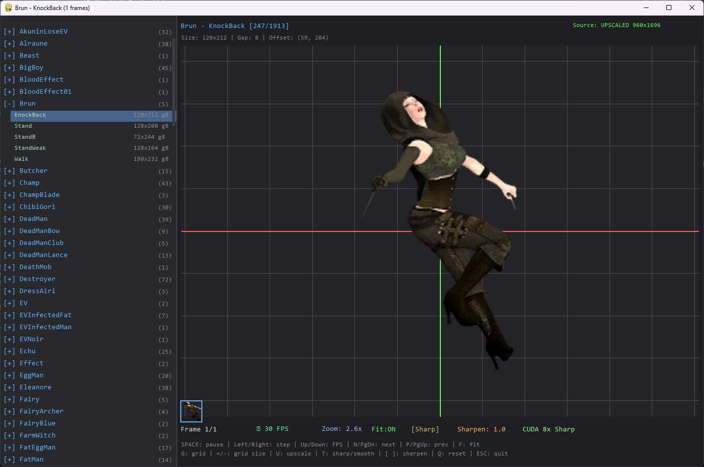

# Guilty Hell Sprite Veiwer




A high-performance, GPU-accelerated Python application designed for dataminers and game preservationists. This tool specializes in viewing, animating, and restoring extracted Unity `Texture2D` sprite sheets.

Unlike standard image viewers, this application is aware of sprite sheet mechanics (frames, gaps, offsets) and integrates **Real-ESRGAN AI upscaling** to convert low-resolution pixel art into high-fidelity HD sprites in real-time.

## 🌟 Key Features

### 🧠 AI & Graphics Pipeline
* **Real-ESRGAN Integration:** Automatically downloads and runs `RealESRGAN_x4plus.pth` to upscale sprites 4x with machine-learning-based detail recovery.
* **CUDA Acceleration:** Fully optimized for NVIDIA GPUs (tested on RTX 4090). Falls back to standard CUDA bicubic upscaling (8x) if the AI model is unavailable.
* **Smart Sharpening:** Adjustable unsharp masking post-process to define edges on upscaled content.
* **Hybrid Rendering:** Toggle instantly between "Sharp" (Nearest Neighbor) for checking pixel grids and "Smooth" (Bilinear) for HD previews.

### 📂 Asset Management
* **Recursive Tree View:** Automatically scans directories and groups files by **Character Name** → **Animation Type**.
* **Regex Parsing:** Intelligently parses filenames to determine sprite cuts, gaps, and frame counts without needing JSON/XML sidecars.
* **Memory Management:** Implements threading to handle AI upscaling in the background without freezing the UI.

### 🛠️ Inspection Tools
* **Dynamic Camera:** Pan and zoom from 0.25x up to 16x.
* **Pixel Grid:** Overlay a customizable grid (adjustable size) to check alignment.
* **Playback Engine:** Variable framerate (FPS) control, pause, and single-frame stepping.

---

## 📋 Asset Naming Convention

This tool was built to handle assets extracted via **AssetStudio**. To function correctly, your sprite sheets **must** follow this specific naming convention so the viewer knows how to slice the frames.

**Format:**
`CharacterName_AnimationName_Width_Height_Gap_OffsetX_OffsetY.png`

**Breakdown:**
| Segment | Description | Example |
| :--- | :--- | :--- |
| `CharacterName` | Grouping identifier | `Warrior` |
| `AnimationName` | Sub-group identifier | `Attack01` |
| `Width` | Width of a single frame | `64` |
| `Height` | Height of a single frame | `64` |
| `Gap` | Pixels between frames | `2` |
| `Offset` | (X/Y) Drawing offset | `0` |

**Example File:**
`Warrior_Attack01_64_64_2_0_0.png`

> *Note: If your files do not match this regex, the viewer will load them but may fail to slice the animation frames correctly.*

---

## ⚙️ Installation

### Prerequisites
* Python 3.8 or higher.
* An NVIDIA GPU is highly recommended for AI features.

### 1. Clone the Repository
```bash
git clone [https://github.com/yourusername/sprite-sheet-viewer.git](https://github.com/yourusername/sprite-sheet-viewer.git)
cd sprite-sheet-viewer
